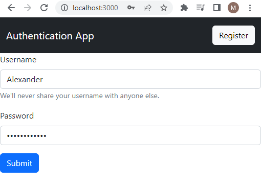
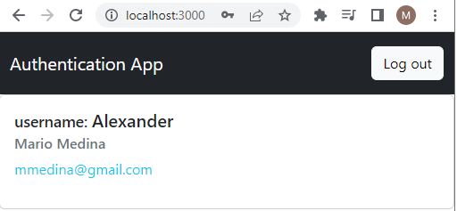
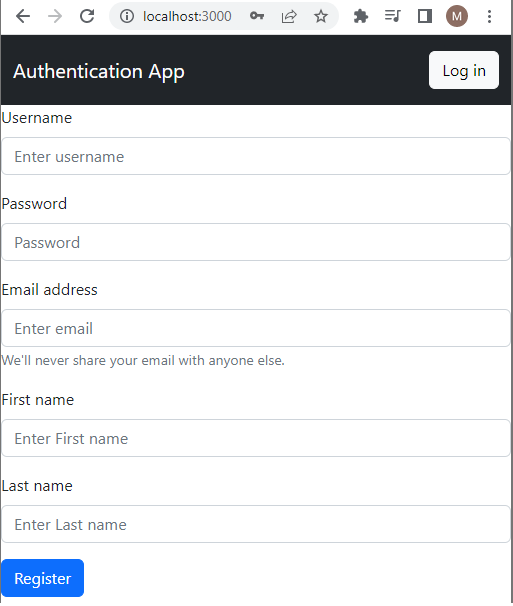

# Guía de inicio rápido: Login con sesiones en React y Django

En este ejemplo explicaré las bases para trabajar con un login y sesiones en React y Django. 
Antes de empezar, [instala Compose](https://docs.docker.com/compose/install/).

### Formulario login


### Formulario logged


### Formulario register


### Software utilizado

```
Django==4.1.5
Mysql==8
node==18.3
react===18.2.0
```

## Deploy con docker compose

```
$ docker compose up -d
```

## Resultados esperados

La lista de contenedores debe mostrar tres contenedores en ejecución y la asignación de puertos como se muestra a continuación:
```
$ docker ps
CONTAINER ID   IMAGE                           COMMAND                  CREATED          STATUS                    PORTS                               NAMES
85701f66ccf8   react_django_mysql01-frontend   "docker-entrypoint.s…"   3 minutes ago    Up 3 minutes             0.0.0.0:3000->3000/tcp              docker_react
68f7e15d4d9e   react_django_mysql01-web        "bash -c 'python3 ma…"   3 minutes ago    Up 3 minutes             0.0.0.0:8085->8000/tcp              docker_django
87b16828263a   mysql:8                         "docker-entrypoint.s…"   3 minutes ago    Up 3 minutes (healthy)   33060/tcp, 0.0.0.0:3308->3306/tcp   docker_db
```

Luego vaya a `http://localhost:3000/` en su navegador web.